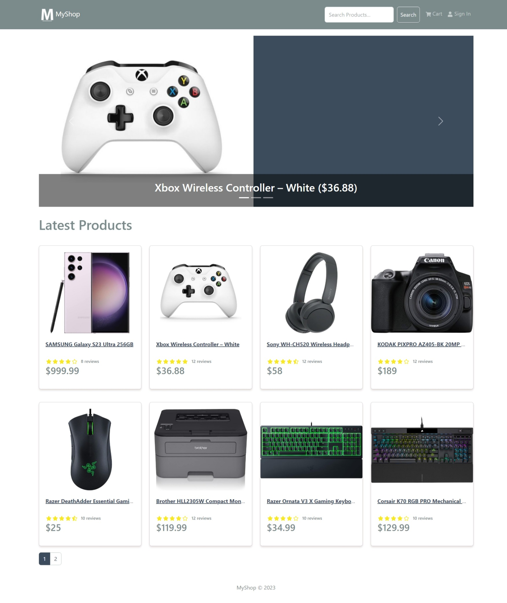

# MyShop eCommerce Platform

> eCommerce platform built with the MERN stack & Redux.



This project is a simple eCommerce  website with shopping cart and authenticaiton. 

<!-- toc -->

  * [Features](#features)
  * [Usage](#usage)
    + [Env Variables](#env-variables)
    + [Install Dependencies (frontend & backend)](#install-dependencies-frontend--backend)
    + [Run](#run)
  * [Build & Deploy](#build--deploy)
    + [Seed Database](#seed-database)
- [Bug Fixes, corrections and code FAQ](#bug-fixes-corrections-and-code-faq)
    + [BUG: Warnings on ProfileScreen](#bug-warnings-on-profilescreen)
    + [BUG: Changing an uncontrolled input to be controlled](#bug-changing-an-uncontrolled-input-to-be-controlled)
    + [BUG: All file types are allowed when updating product images](#bug-all-file-types-are-allowed-when-updating-product-images)
    + [BUG: Throwing error from productControllers will not give a custom error response](#bug-throwing-error-from-productcontrollers-will-not-give-a-custom-error-response)
      - [Original code](#original-code)
    + [BUG: Bad responses not handled in the frontend](#bug-bad-responses-not-handled-in-the-frontend)
      - [Example from PlaceOrderScreen.jsx](#example-from-placeorderscreenjsx)
    + [BUG: After switching users, our new user gets the previous users cart](#bug-after-switching-users-our-new-user-gets-the-previous-users-cart)
    + [BUG: Passing a string value to our `addDecimals` function](#bug-passing-a-string-value-to-our-adddecimals-function)
    + [FAQ: How do I use Vite instead of CRA?](#faq-how-do-i-use-vite-instead-of-cra)
      - [Setting up the proxy](#setting-up-the-proxy)
      - [Setting up linting](#setting-up-linting)
      - [Vite outputs the build to /dist](#vite-outputs-the-build-to-dist)
      - [Vite has a different script to run the dev server](#vite-has-a-different-script-to-run-the-dev-server)
      - [A final note:](#a-final-note)
  * [License](#license)

<!-- tocstop -->

## Features

- Shopping cart
- Product reviews and ratings
- Top products carousel
- Product pagination
- Product search feature
- User profile with orders
- Admin product management
- Admin user management
- Admin Order details page
- Mark orders as delivered option
- Checkout process (shipping, payment method, etc)
- PayPal / credit card integration (not really work for now)
- Database seeder (products & users)

## Usage

- Install MongoDB Community Server on your PC - [MongoDB Community Server ](https://www.mongodb.com/try/download/community)

### Env Variables

Rename the `.env.example` file to `.env`  and add the following (or replace `.env` file content with)

```
NODE_ENV = development
PORT = 5000
MONGO_URI = your mongodb uri
JWT_SECRET = 'abc123'
PAYPAL_CLIENT_ID = your paypal client id
PAGINATION_LIMIT = 8
```

Change the JWT_SECRET and PAGINATION_LIMIT to what you want

### Install Dependencies (frontend & backend)

```
npm install
cd frontend
npm install
```

### Run

At the root folder (outside `frontend` and `backend` folder)

```

# Run frontend (:3000) & backend (:5000)
npm run dev

# Run backend only
npm run server
```

## Build & Deploy

```
# Create frontend prod build
npm run build
```

### Seed Database

You can use the following commands to seed the database with some sample users and products as well as destroy all data

```
# Import data
npm run data:import

# Destroy data
npm run data:destroy
```

```
Sample User Logins

admin@email.com (Admin)
123456

john@email.com (Customer)
123456

jane@email.com (Customer)
123456
```
